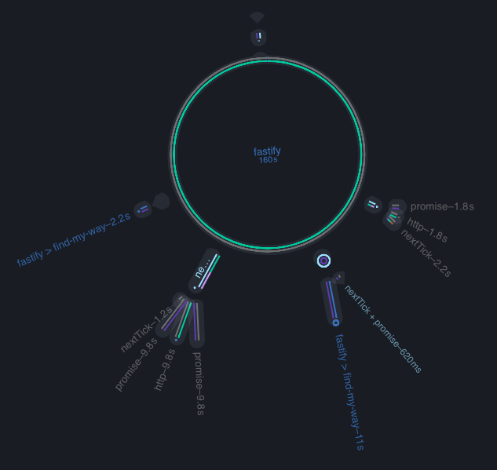

# SSR Example
This example uses the [react-pwa](https://github.com/nearform/react-pwa) and [autocannon](https://github.com/mcollina/autocannon).  The autocannon script will do the following:

1. request the first three pages of top stories
2. request the comments page
3. request the show page
4. request the ask page

Each request is rendered on the server.

## Dependencies
[node-clinic](https://github.com/nearform/node-clinic)
[autocannon](https://github.com/mcollina/autocannon)
[react-pwa](https://github.com/nearform/react-pwa)

```
npm i -g clinic autocannon 
```

```
git clone git@github.com:nearform/react-pwa.git
cd react-pwa
npm i
```

## Running the example
We only need the server for this example to work. As mentioned above, all requests are rendered by the server.
```
clinic bubbleprof -- node src/server
```
In a second terminal run the [stories](./stories.js) script
```
node server-side-rendering/stories.js
```
Once autocannon completes its run you should see results like similar to what is below:
```
Running 10s test @ http://localhost:3000
10 connections
...
40 requests in 10s, 474 kB read
```
At this point, you can stop the server that bubbleprof is gathering details about.  Once bubbleprof finishes its analyses of the data it will open the UI with a visualizaiton of the results.



As you can see in the visualization, the bulk of our asynchronous time in the react-pwa is spent in Fastify, which means our app is optimized to the best we can get it.
