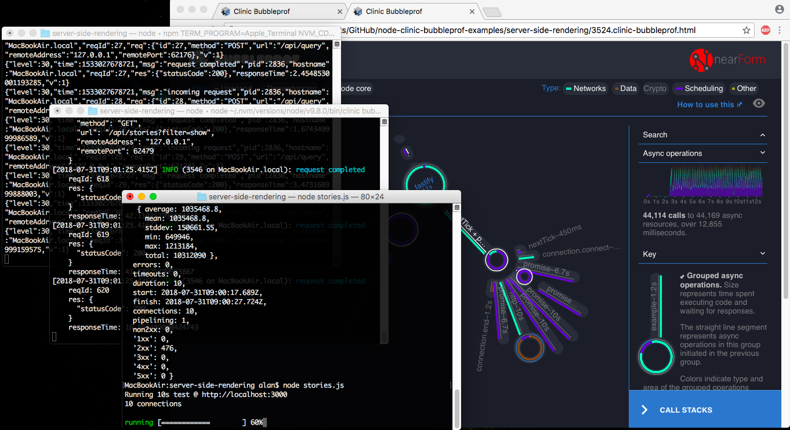

# SSR Example
This example uses code similar to the [react-pwa](https://github.com/nearform/react-pwa) and [autocannon](https://github.com/mcollina/autocannon).  There are Two autocannon scripts that will do the following:

1. request stories via the happy path
2. request stories with an event loop issue

Each request is rendered on the server.

## Dependencies
[node-clinic](https://github.com/nearform/node-clinic)

[autocannon](https://github.com/mcollina/autocannon)

[react-pwa](https://github.com/nearform/react-pwa)

```
npm i -g clinic autocannon
```

```
cd server-side-rendering
npm i
```

## Running the example
There are two servers involved with this example.

1. contains the API for doing the SSR.
2. contains the API that the first server requests data from.

As mentioned above, all requests are rendered by the server.

Open three console windows, and navigate each one to this `server-side-rendering` directory.

#### Console 1: Start the data server
```
npm run start:data
```
#### Console 2: Start the SSR server with bubbleprof

```
clinic bubbleprof -- node src/server
```

#### Console 3: Run the autocannon script to request the stories
```
node stories.js
```
Once autocannon completes its run, you should see results like similar to what is below:

```
Running 10s test @ http://localhost:3000
10 connections
...
40 requests in 10s, 474 kB read
```

At this point, switch back to Console 2 (the SSR server being monitored by Bubbleprof) and close the server (`ctrl-c`), which begins the Bubbleprof analysis.  Once this finishes, a browser window will open containing the Bubbleprof UI with a visualization of the results.


